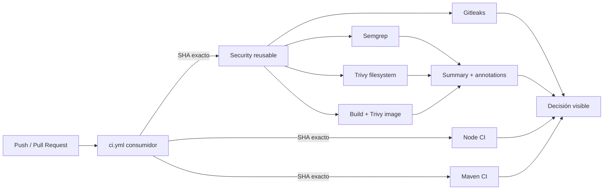

# KAN-117 — Roadmap de reusable GitHub Actions

## Objetivo

Crear una raíz de confianza reutilizable para que NestJS, Spring Boot y Quarkus ejecuten el mismo modelo de CI y seguridad sin copiar lógica entre repositorios.

KAN-117 construye el mecanismo. KAN-118 añadirá la política baseline/delta compatible con Shape Up.

## Qué significa scaffolding

El scaffolding es el esqueleto mínimo ejecutable de un proyecto: estructura de carpetas, manifiesto de dependencias, configuración, prueba base, endpoint de salud, Dockerfile y documentación. No representa todavía el producto ni contiene lógica de negocio.

### NestJS

```text
devsecops-poc-nestjs/
├── src/
│   ├── health/
│   │   ├── health.controller.ts
│   │   ├── health.controller.spec.ts
│   │   └── health.module.ts
│   ├── app.module.ts
│   └── main.ts
├── test/app.e2e-spec.ts
├── package.json
├── package-lock.json
├── tsconfig.json
├── Dockerfile
└── README.md
```

### Spring Boot

```text
devsecops-poc-spring-boot/
├── src/main/java/dev/poc/spring/
├── src/main/resources/application.properties
├── src/test/java/dev/poc/spring/
├── .mvn/
├── mvnw
├── pom.xml
├── Dockerfile
└── README.md
```

### Quarkus

```text
devsecops-poc-quarkus/
├── src/main/java/dev/poc/quarkus/
├── src/main/resources/application.properties
├── src/test/java/dev/poc/quarkus/
├── .mvn/
├── mvnw
├── pom.xml
├── Dockerfile
└── README.md
```

### Reusable workflows

```text
devsecops-poc-workflows/
├── .github/workflows/
│   ├── reusable-node-ci.yml
│   ├── reusable-maven-ci.yml
│   └── reusable-security.yml
└── README.md
```

## Flujo conceptual



## Paso a paso de implementación

### 1. Definir el contrato central

El repositorio `devsecops-poc-workflows` contiene la lógica compartida. Cada archivo declara `workflow_call`, que funciona como una API interna de CI.

Entradas actuales:

- Node CI: versión de Node.js.
- Maven CI: versión de Java.
- Security: nombre local de la imagen que será construida y escaneada.

### 2. Separar pruebas de seguridad

Las pruebas responden si el código funciona. Los scanners responden qué riesgo introduce. Separarlos permite observar fallos independientes y evita ocultar un scanner detrás de un build fallido.

### 3. Aplicar mínimo privilegio

El workflow parte de `permissions: {}`. Cada job solicita únicamente `contents: read`.

KAN-117 no solicita `id-token: write`: todavía no existe autenticación contra GCP. Esa capacidad solo debe aparecer en el job de despliegue futuro.

### 4. Fijar la cadena de suministro

- Todas las GitHub Actions se referencian mediante SHA completo.
- Semgrep se ejecuta desde una imagen fijada por digest OCI.
- Trivy Action usa un SHA de la versión v0.36.0.
- El binario Trivy se mantiene en v0.69.3, reconocido como seguro frente al incidente de marzo de 2026.

Un comentario conserva la versión humana, pero el runner ejecuta el SHA inmutable.

### 5. Implementar CI de Node.js

Orden deliberado:

1. Checkout.
2. Configurar Node.js 22.
3. `npm ci` desde el lockfile.
4. Pruebas unitarias.
5. Pruebas e2e.
6. Build.

### 6. Implementar CI de Java

Spring Boot y Quarkus comparten el mismo contrato:

1. Checkout.
2. Configurar Java 21.
3. Usar Maven Wrapper del repositorio.
4. Ejecutar `./mvnw -B clean verify`.

La diferencia entre frameworks vive en sus `pom.xml`, no en el pipeline central.

### 7. Implementar los controles de seguridad

Los cuatro jobs se ejecutan en paralelo:

- Gitleaks: examina el historial Git completo.
- Semgrep: SAST y salida SARIF.
- Trivy filesystem: SCA de manifiestos y lockfiles.
- Trivy image: construye el Dockerfile y analiza el sistema operativo y las librerías de la imagen.

No se usa `continue-on-error`. Un hallazgo mantiene el job fallido, mientras `if: always()` conserva la evidencia SARIF.

### 8. Conservar evidencia sin depender de GHAS

Los repositorios son privados y personales; GitHub Code Scanning puede no estar
disponible. Por eso la aceptación usa summaries y annotations visibles. SARIF/JSON
permanece transitorio dentro del runner y no se publica como artifact.

### 9. Versionar y definir rollback

La versión corregida y validada es `poc-v1.0.1`, commit:

```text
ad9d553563cb027877f2c676cab7894bb095edc6
```

Los consumidores llaman ese SHA, nunca `main`. El tag aporta una versión legible, pero la seguridad depende del SHA inmutable.

Rollback:

1. Sustituir el SHA en el workflow consumidor por el commit anterior conocido.
2. Abrir el Pull Request.
3. Ejecutar nuevamente todos los checks en GitHub Actions.
4. Promover el cambio solo si tests y controles de seguridad terminan correctamente.

### 10. Conectar los tres consumidores

Cada aplicación tiene un `.github/workflows/ci.yml` pequeño. Solo define eventos, concurrencia, permisos, inputs y el SHA central. La lógica permanece en un único repositorio.

### 11. Ejecutar, corregir y verificar

El primer ciclo encontró deuda en las imágenes. No se debilitó el scanner: se corrigió el runtime y se alineó el formato SARIF con la severidad declarada.

- Los tres runtimes actualizan paquetes corregibles durante la construcción en GitHub Actions.
- La imagen NestJS elimina npm/npx porque producción solo necesita el binario `node`; esos paquetes introducían findings sin aportar capacidad de ejecución.
- Trivy usa `limit-severities-for-sarif: true` para que SARIF y el exit code respeten el gate `CRITICAL,HIGH`.
- Los hallazgos MEDIUM siguen visibles cuando se escanean con una política que los incluya, pero no contradicen el gate declarado para KAN-117.

Resultado final:

| Repositorio | Tests/build | Gitleaks | Semgrep | Trivy SCA | Trivy imagen |
|---|---|---|---|---|---|
| NestJS | OK | OK | OK | OK | OK |
| Spring Boot | OK | OK | OK | OK | OK |
| Quarkus | OK | OK | OK | OK | OK |

Toda la validación se ejecutó en GitHub Actions; no se ejecutaron builds, tests, Docker ni scanners localmente.

### 12. Límite entre KAN-117 y KAN-118

KAN-117 debe demostrar que los controles corren, fallan de forma visible y producen evidencia.

KAN-118 debe introducir:

- baseline aprobado;
- comparación por delta;
- bloqueo solo para riesgo nuevo o materialmente peor;
- métricas de duración, estabilidad y tasa de bloqueo;
- política de outage y excepciones con expiración.

## Criterio de cierre de KAN-117

- Los tres consumidores llaman workflows centrales por SHA.
- Las Actions están fijadas por SHA y Semgrep por digest.
- Los jobs tienen permisos mínimos y no usan `id-token`.
- Tests, Gitleaks, Semgrep y ambos modos de Trivy se ejecutan.
- Los resultados quedan visibles como summaries y annotations sin descargar artifacts.
- Los findings producen fallo visible, no bypass silencioso.
- Versionado y rollback están documentados.

## Estado actual

`KAN-117` está técnicamente validada: todos los criterios de aceptación y los tres pipelines terminaron correctamente. La política baseline/delta compatible con Shape Up permanece deliberadamente en KAN-118.
